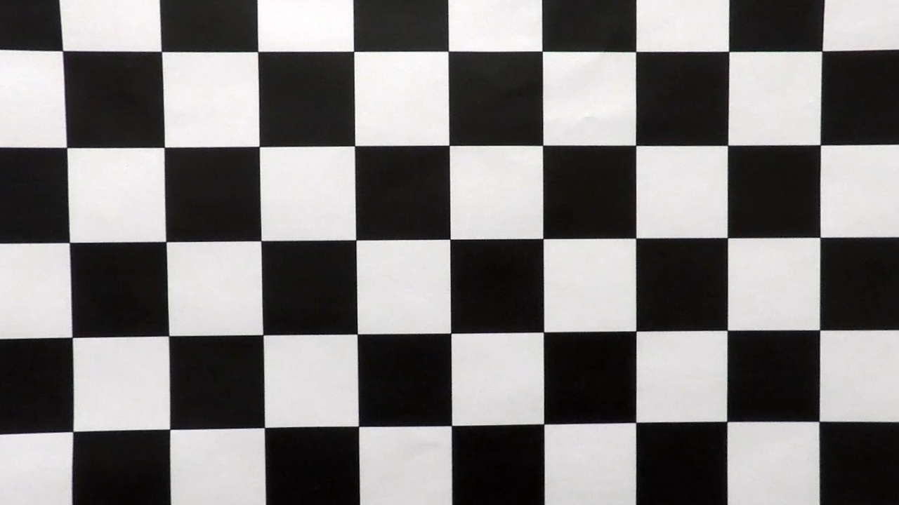
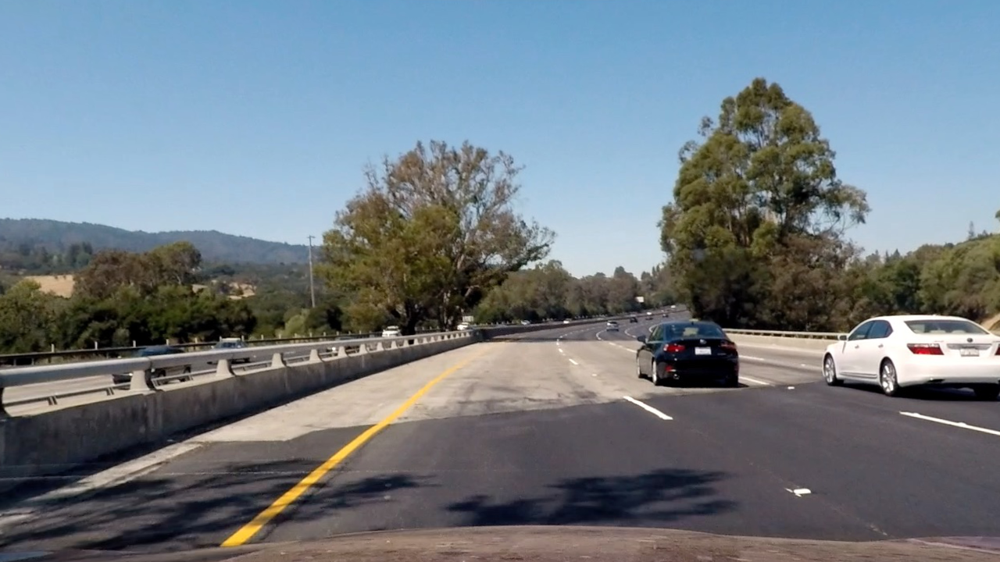
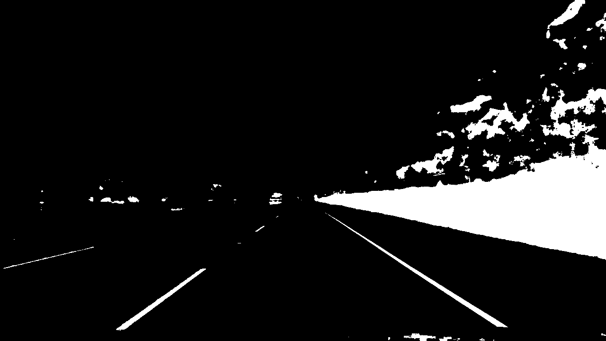
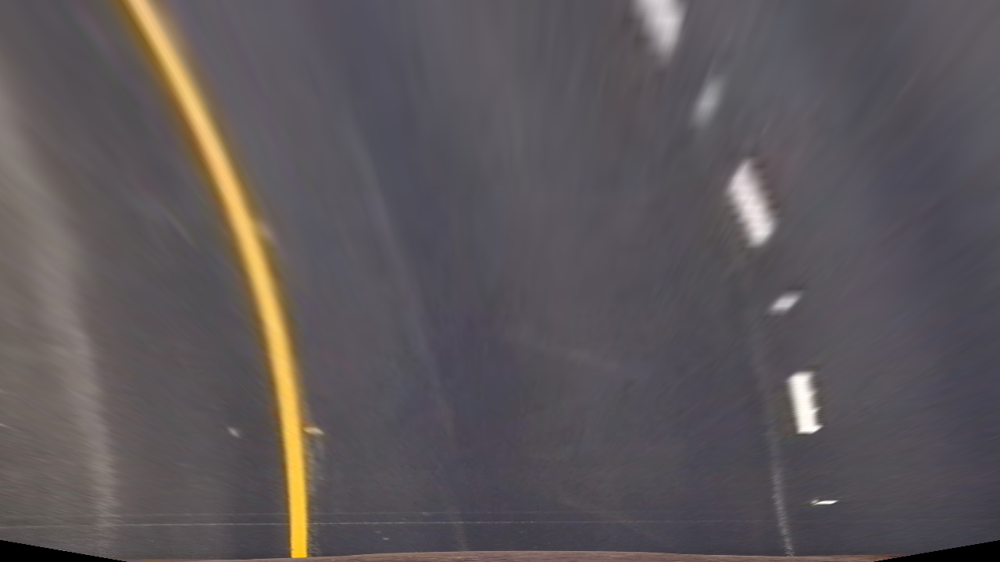
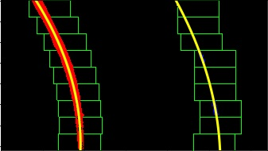
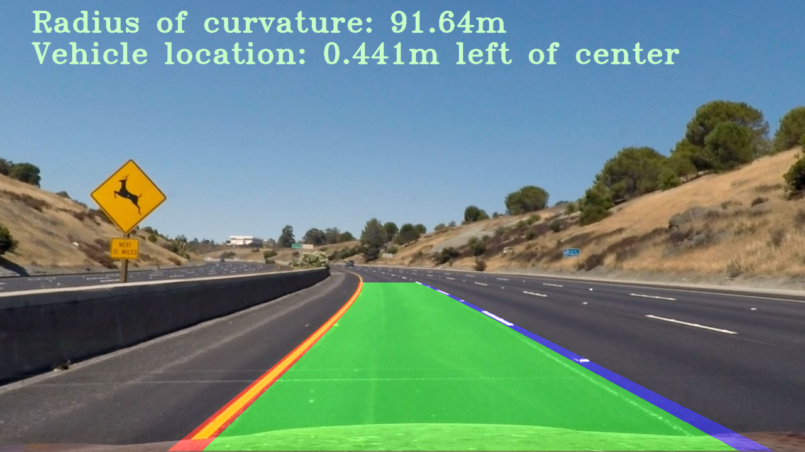

## Advanced Lane Finding Writeup
#### Jeremy Matson
---

**Advanced Lane Finding Project**

The goals / steps of this project are the following:

* Compute the camera calibration matrix and distortion coefficients given a set of chessboard images.
* Apply a distortion correction to raw images.
* Use color transforms, gradients, etc., to create a thresholded binary image.
* Apply a perspective transform to rectify binary image ("birds-eye view").
* Detect lane pixels and fit to find the lane boundary.
* Determine the curvature of the lane and vehicle position with respect to center.
* Warp the detected lane boundaries back onto the original image.
* Output visual display of the lane boundaries and numerical estimation of lane curvature and vehicle position.


## [Rubric](https://review.udacity.com/#!/rubrics/571/view) Points

### Here I will consider the rubric points individually and describe how I addressed each point in my implementation.  

---

### Writeup / README

#### 1. Provide a Writeup / README that includes all the rubric points and how you addressed each one.  You can submit your writeup as markdown or pdf.  [Here](https://github.com/udacity/CarND-Advanced-Lane-Lines/blob/master/writeup_template.md) is a template writeup for this project you can use as a guide and a starting point.  

You're reading it!

### Camera Calibration

#### 1. Briefly state how you computed the camera matrix and distortion coefficients. Provide an example of a distortion corrected calibration image.

The camera calibration code is contained in code cells 2 and 3 of the IPython notebook file `./Advanced Lane Finding.ipynb`.

I began the calibration process by creating arrays for the object points as well as the image points. The object points array stores the 3-dimensional coordinates of the chessboard corners that can be visually identified in the image. The image points array stores a calculated 2-dimensional location of the detected chessboard corners.

The `import_calibration_images()` method creates a new array that contains indices of the chessboard corners (x, y, z), stored as individual arrays in `objp`. The function is expecting to find 6 rows of 9 corners. These arrays are generated for each image to be imported from the `camera_cal/calibration` directory in which all 45 corners can be successfully detected, and they are then appended to `objpoints`.

The `objpoints` and `imgpoints` arrays were both passed to the `cv2.calibrateCamera()` function through the `cal_camera()` function to generate and return the calibration matrix and distortion coefficients. All of the provided example images were passed to the `undistort_image()` function that utilizes the `cv2.undistort()` function, and then were saved to the `./output_images/undistorted_text_images` directory. 

An undistorting example of the camera calibration process is:

<br>
<table>
    <tr>
        <th style="text-align: center">Original</th>
        <th style="text-align: center">Undistorted</th>
    </tr>
    <tr>
        <td></td>
        <td></td>
    </tr>
</table>
<br>

### Pipeline (single images)

My lane finding pipeline is defined in code cell 34 in `./Advanced Lane Finding.ipynb`. 

#### 1. Provide an example of a distortion-corrected image.

The distortion-correction was performed on all of the images in the `./test_images` directory, and it is performed on each frame of the videos as they are processed. An example of a corrected image is:

<br>
<table>
    <tr>
        <th style="text-align: center">Original</th>
        <th style="text-align: center">Undistorted</th>
    </tr>
    <tr>
        <td></td>
        <td></td>
    </tr>
</table>
<br>

#### 2. Describe how (and identify where in your code) you used color transforms, gradients or other methods to create a thresholded binary image.  Provide an example of a binary image result.

I experimented with many different types of filters, as well as combinations of them to find adequate lane line detection for the project video. The code for these filters is in code cell 8.

For my lane finding pipeline, I applied filters in the LAB and LUV colorspaces. Specifically, I used the B color channel in the LAB colorspace as it performed a fair job on yellow line detection, and I used the L channel from the LUV colorspace for the white line detection. The combination of these two thresholded filters produced the binary result that I later used for polynomial line fitting. The code is contained in the `select_lines_from_colorspaces()` function.

To tune the hyperparameters that served as thresholding values for these colorspace filters, I utilized the Interact Widget, which provided me with sliders to visualize the effects of each colorchannel. The code for this is contained in code cells 22-24.

An example of a filtered binary image is:
<br>

<br>

#### 3. Describe how (and identify where in your code) you performed a perspective transform and provide an example of a transformed image.

The code for my perspective transform is contained in the `get_lane_perspective()` function in code cell 19. This function receives an input image from its caller. It then utilizes hardcoded source and destination points for the transform to generate a warped image, and the perspective transform matrix, `M`, with its inverse `Minv`.

The source points that I chose are:

```python
top_left_corner = (585, 450)
top_right_corner = (width-590, 450)
bottom_right_corner = (width-120, height)
bottom_left_corner = (120, height)
```

The destination points that I chose are based upon an offset from the edge of the destination image. They are defined as follows:

```python
dst_offset = width * 0.2
dst = np.float32([[dst_offset,0], [width-dst_offset,0], [width-dst_offset, height], [dst_offset,height]])
```

The resulting point relation is as follows:

| Source      | Destination   |
|:-----------:|:-------------:|
| 585, 450    | 256, 0        |
| 690, 450    | 1024, 0       |
| 1160, 720   | 1024, 720     |
| 120, 720    | 256, 720      |

An example warped image is:

<br>

<br>

#### 4. Describe how (and identify where in your code) you identified lane-line pixels and fit their positions with a polynomial?

After binary filtering and warping the images, it was necessary to determine where the lane lines existed in the images, and fit polynomials to them. The function `find_lane_pixels()` in code cell 28 takes the warped image as a parameter, and returns x and y-coordinates detected from the left and right lane lines, along with an output image for visualization.

I started by generating a histogram of the bottom third of the warped image (full width). The code for this is in code cell 25, in the `hist()` function. It was necessary to divide the image in half and search for the peak of the histogram in the left and right halves. These points have high probability that they are detected lane lines, so they are the beginning x-coordinates to start searching for our lane lines. 

Next, a sliding window approach is utilized to traverse the y-axis from the bottom to the top of the image to detect additional lane line point coordinates within a thresholded distance from the last detected points. This helps to filter out noise in the image that may attempt to adjust the polynomial fitment beyond reasonable lane line arc radius. I used 10 equal height rectangles with a 75 pixel margin. It was required that a minimum pixel count be met to minimize noise effects on the line detection, and this value was set to 50 pixels.

The detected pixel arrays were then sent to the `fit_poly()` function in code cell 25. This function utilizes the NumPy `polyfit` function to calculate coefficients of a second order polynomial, fit to the detected lane line pixels. Lane line polynomial coordinates were then calculated from these coefficients and are returned.

An example of polynomial lines fit to detected lane line pixels is:

<br>

<br>

#### 5. Describe how (and identify where in your code) you calculated the radius of curvature of the lane and the position of the vehicle with respect to center.

The radius of curvature of the lane line polynomials is handled in code cell 29. The `measure_curvature_pixels()` function takes the left and right polynomial fits, and the y-axis of the image in as parameters. The curve radius is then calculated from the polynomials, and multiplied by a scaling value to convert from pixel dimensions to meters.

The position of the vehicle respective of the lane center is calculated in the function `measure_dist_from_center()` in code cell 29. This function receives the image, and the left and right lane line fits. The x-position of each lane line is calculated from the coefficients of the lane line fits at the maximum height of the image. This position is then averaged to determine the lane center, and this value is the subtracted from half of the image width. It is assumed that the horizontal center of the camera image is coincident with the horizontal center of the vehicle.

#### 6. Provide an example image of your result plotted back down onto the road such that the lane area is identified clearly.

Upon completion of the lane line detection, a semi-transparent polygon was drawn onto the image identifying the lane in green color. The left lane line was drawn in red, and the right lane line was drawn in blue. This was defined in the function `draw_lane()` in code cell 30.

After the polygon was drawn, the image was unwarped from the perspective transform using the inverse transformation matrix `Minv` and the `cv2.warpPerspective()` function. The curve radius information and vehicle position relative to lane center is drawn on the image by the `draw_curve_radius_info()` function in code cell 32, and the completed image is returned.

An example of a detected lane is:

<br>

<br>

---

### Pipeline (video)

#### 1. Provide a link to your final video output.  Your pipeline should perform reasonably well on the entire project video (wobbly lines are ok but no catastrophic failures that would cause the car to drive off the road!).

Here's a [link to my video result](./output_videos/project_video.mp4)

---

### Discussion

#### 1. Briefly discuss any problems / issues you faced in your implementation of this project.  Where will your pipeline likely fail?  What could you do to make it more robust?

Numerous issues were encountered in this lane finding project, and they typically stemmed from image filtering processes. Removing the noise from the images in an attempt to extract the exact lane lines that are easily perceived by a real person are quite difficult.

I chose to utilize masking in multiple colorspaces as they tended to return relatively clear definitions of the lane lines when they were combined. Saturation masking was used early on, but it struggled to detect lane lines when the color of the road changed. I did try magnitude and directional filtering of the pixels as well, but they tended to produce more noise in the image. They may be valid in certain circumstances, but did not prove useful enough for the initial challenge.

Detecting lane lines in varying brightness, such as shadows can cause simple methods to rapidly fail. I implemented a `Line()` class in code cell 34 that allowed me to store a history of lane line coordinates and polynomial fit coefficients. This allowed me to implement a moving average filter for smoothing, as well as line rejection for newly detected polynomials that are improbable to be accurate. In the case of line rejection, a best_fit line was returned and drawn onto the image.

This algorithm likely will fail on inclines and declines as the points selected for lane perspective transformation are static. A dynamic method here that can adjust the distance and width of the warped lane lines to maintain parallelism can potentially mitigate these issues.

Another likely failure condition could be in areas of recent road construction or patch work that creates inconsistencies in lane coloring, and the potential to detect additional lane lines where the colors change. This may be evaded by implementing a convolutional filter, or a minimum line pixel width requirement to reduce the potential for false positive detection.

I plan to continue to tweak and tune this algorithm to improve overall robustness in the aforementioned situations.